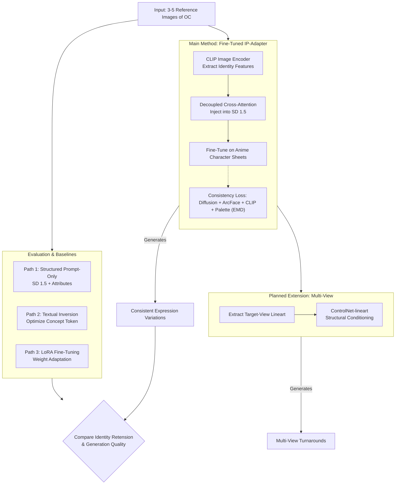

Q：我只想做2d的漫画的oc设定图。告诉我应该用什么数据，怎么去训练

好，专注在纯 2D 漫画路线上，我来完整讲清楚。

------

## 任务重新定义

你要做的事情是：给定 1~3 张某个 OC 的参考图，生成包含正面/侧面/背面、多种表情、若干姿态的完整设定图，并且所有图之间角色外观一致。

全程不用 3D，只在 2D 图像空间里操作。

------

## 数据

### 核心数据：角色设定图（Character Sheet）

这是最关键的数据，你需要的不是单张角色图，而是"同一个角色的多角度多表情成套图"。

**Danbooru** 是最主要的来源。用以下标签组合搜索：

```
character_sheet
reference_sheet  
turnaround
multiple_views
expression_sheet
front_view side_view back_view
```

Danbooru 有完整的数据库下载方式，也有 HuggingFace 上的镜像版本（`animefull-final-pruned` 等），SFW 部分直接用 SafeBooru。目标是收集约 **5,000~20,000 张**设定图。

**Pixiv** 是另一个重要来源。搜索「キャラクターデザイン」「設定画」「ターンアラウンド」可以找到大量高质量设定图。但 Pixiv 爬取需要注意版权，课程研究用途一般可行，不能商用。

**已有 HuggingFace 数据集：**

```
skytnt/anime-segmentation        # 动漫人物分割
nyanko7/danbooru2021             # Danbooru标注版
Linaqruf/animie-dataset          # 动漫角色数据
```

### 数据处理流程

收集到原始设定图之后，要做这几步处理：

**第一步：分割单张视角**

很多设定图是把正面/侧面/背面拼在一张大图里的，需要用目标检测把每个视角单独裁出来。可以用 YOLOv8 训练一个简单的"设定图面板检测器"，或者更粗暴地用固定比例切割（大多数设定图是左中右三等分）。

**第二步：人脸对齐**

每张裁出来的视角图都做人脸检测 + 对齐（用 face-alignment 库），统一到 512×512。

**第三步：构建训练对**

训练时需要的数据格式是：

```python
{
    "reference": 正面图,           # 输入，作为身份参考
    "target": 侧面图 / 背面图,     # 输出目标
    "angle": "side" / "back",     # 视角标签
    "source_sheet_id": "xxx"      # 用来追踪同一张设定图的不同视角
}
```

同一张设定图里裁出来的正面/侧面/背面是天然的配对数据，这是训练的基础。

**第四步：表情数据**

额外搜索带 `expressions` 或 `expression_chart` 标签的图，这些是同一角色的多种表情合集。同样裁出每个表情单独处理，按情绪标注（用分类模型自动打标，或者用 ChatGPT/LLaVA 描述）。

------

## 模型架构

整个系统由三个组件构成，可以分阶段搭建：

### 组件一：身份编码器（Identity Encoder）

负责从参考图里提取"这个角色是谁"的信息，并在生成时持续注入。

**直接用 IP-Adapter** 是最省力的起点。IP-Adapter 用 CLIP image encoder 提取参考图特征，通过 decoupled cross-attention 注入 SD 的生成过程，不需要 fine-tune，推理时直接用。

但 IP-Adapter 是通用模型，对漫画风格的身份保留效果一般。**更好的方案**是在漫画数据上重新训练一个 IP-Adapter，让它的 image encoder 更懂漫画角色的身份特征（发色、眼型、服装这些漫画里最有辨识度的维度）。这部分本身就是研究贡献。

训练 IP-Adapter 的数据就用上面收集的设定图：用正面图作为 reference，同一角色的侧面图/表情变体作为生成目标，让模型学会"看一张图 → 知道怎么生成这个角色的其他图"。

### 组件二：视角/姿态控制器（View & Pose Controller）

控制生成的是哪个角度或什么姿态，用 ControlNet 实现。

**视角控制：** 用 `ControlNet-lineart` 或 `ControlNet-canny`，把目标视角的线稿作为结构条件。线稿从哪里来？有两种办法：

一是从数据集里取同一角色的其他视角图提取线稿，当作 ControlNet 输入（训练时用，推理时没有）。

二是训练一个**视角变换网络**，输入正面图，输出"预测的侧面线稿"，再把这个预测线稿传给 ControlNet。这是这个模块最有研究价值的地方，因为 2D 漫画的视角变换不是几何变换，是有艺术规律的——漫画侧脸的眼睛画法和正脸完全不同，模型需要学会这套规律。

**姿态控制：** 直接用 `ControlNet-openpose`，用 DWPose 提取目标姿态的骨架，传给 ControlNet 即可。这部分最成熟，不需要从头研究。

### 组件三：一致性约束（Consistency Loss）

训练时在 loss 里加以下几项：

```python
total_loss = (
    diffusion_loss                        # 标准扩散 loss
  + λ1 * arcface_loss(output, reference)  # 人脸身份一致性
  + λ2 * clip_loss(output, reference)     # 整体外观一致性（含服装）
  + λ3 * palette_loss(output, reference)  # 颜色一致性（防止发色变化）
)
```

其中 `palette_loss` 是你们可以自己定义的：提取两张图主要颜色的直方图，计算分布距离，强制生成图和参考图的主要颜色接近。

------

## 训练流程

### 阶段一：表情编辑（2~3周，课程项目可行）

只训练"同一角色 + 不同表情"这个子任务，是最容易出成果的切入点。

```
训练数据: 表情合集图（expression_chart标签）
          每张图裁出6~8个表情，按 neutral/happy/sad/angry/surprised/crying 分类
          
训练目标: 给定参考图（neutral表情）+ 目标情绪标签 → 生成该表情的角色头像

模型: SD1.5 + IP-Adapter（身份） + 情绪文本条件
     Loss: diffusion_loss + arcface_loss + palette_loss
```

**Midway 可展示的结果：** 输入一张 OC 正脸，输出 6 种表情变体，评估 ArcFace 相似度和 FID。

### 阶段二：多视角生成（4~6周）

在阶段一的基础上加入视角控制。

```
训练数据: 正面/侧面/背面三联图（character_sheet / turnaround标签）
          构建 (正面图, 侧面线稿, 侧面图) 三元组
          
训练目标: 给定正面图（IP-Adapter身份） + 侧面线稿（ControlNet结构） → 侧面图

关键实验: 对比 "有ControlNet线稿引导" vs "只有IP-Adapter" 的视角一致性差异
```

### 阶段三：完整设定页（长期）

整合表情 + 视角 + 姿态，加入自动排版，生成完整设定页图像。

------

## 评估指标

| 指标                   | 评估什么     | 怎么算                                  |
| ---------------------- | ------------ | --------------------------------------- |
| ArcFace Similarity     | 人脸身份保留 | 生成图 vs 参考图的人脸嵌入余弦相似度    |
| Color Palette Distance | 颜色一致性   | 两图主色调直方图的 Earth Mover Distance |
| FID                    | 整体生成质量 | 生成集 vs 真实设定图集的分布距离        |
| View Accuracy          | 视角是否正确 | 用分类器判断生成图是否是目标视角        |
| 用户研究               | 综合主观质量 | 让人判断"这两张图是不是同一个角色"      |

------

## 入门建议

如果今天就想开始，最快的路径是：

```bash
# 1. 下载 IP-Adapter 预训练权重
# https://github.com/tencent-ailab/IP-Adapter

# 2. 在 SafeBooru 上下载 2000 张 expression_chart 图
# 用 tag: expression_chart rating:safe

# 3. 用 face-alignment 库做人脸裁剪和对齐
pip install face-alignment

# 4. 跑 IP-Adapter 推理，先看看 zero-shot 效果如何
# 再决定是否需要 fine-tune
```

先看 IP-Adapter 不 fine-tune 直接用的效果，这一步一天内可以完成。效果如果差，再针对性地收集数据做 fine-tune，方向会更清晰。

好，专门讲数据获取这件事，从哪找、怎么下、怎么处理，全部说清楚。

------

## 你需要哪两类数据

**第一类：多视角设定图（训练视角一致性）** 同一角色的正面/侧面/背面拼在一起的图，用来学习"同一角色在不同角度下长什么样"。

**第二类：表情合集图（训练表情一致性）** 同一角色的多种表情排列在一起的图，用来学习"同一角色在不同表情下长什么样"。

------

## 数据来源一：SafeBooru（最推荐，直接下载）

SafeBooru 是 Danbooru 的 SFW 版本，内容全部无限制级，学术使用最安全。

**搜索标签：**

```
# 多视角设定图
character_sheet
reference_sheet
turnaround
multiple_views
front_view back_view

# 表情合集
expression_sheet
expressions
multiple_expressions
emotion_chart
```

**下载方式：** 用 `gallery-dl`，这是专门为图库网站设计的命令行下载工具：

```bash
pip install gallery-dl

# 下载 SafeBooru 上所有 character_sheet 标签的图
gallery-dl "https://safebooru.org/index.php?page=post&s=list&tags=character_sheet"

# 限制数量，先下 2000 张试试
gallery-dl --range 1-2000 "https://safebooru.org/index.php?page=post&s=list&tags=character_sheet"
```

下载时会自动保存图片和对应的 JSON 元数据（包含标签、尺寸、来源等），非常方便后续过滤。

**预计数量：** SafeBooru 上 `character_sheet` 标签约有 15,000+ 张，`expression_sheet` 约有 8,000+ 张，够用了。

------

## 数据来源二：Danbooru HuggingFace 镜像（大规模，省去爬取）

如果不想自己爬，HuggingFace 上有现成的 Danbooru 数据集镜像：

```python
from datasets import load_dataset

# 加载带标签的 Danbooru 子集
ds = load_dataset("nyanko7/danbooru2023-subset", split="train")

# 按标签过滤，只保留设定图
def is_character_sheet(example):
    tags = example.get("tags", "")
    return any(t in tags for t in [
        "character_sheet", "reference_sheet", 
        "turnaround", "expression_sheet"
    ])

filtered = ds.filter(is_character_sheet)
```

这个方法不需要爬取，但数据集文件很大（几十 GB），需要足够的磁盘空间。

------

## 数据来源三：Pixiv（质量最高，操作最复杂）

Pixiv 上的设定图质量普遍高于 Danbooru，因为很多专业画师会在这里发布完整的角色设计稿。但 Pixiv 爬取需要账号。

**搜索关键词：**

```
キャラクター設定（角色设定）
ターンアラウンド（正面侧面背面）
表情集（表情合集）
キャラクターデザイン（角色设计）
```

**下载工具：** 同样用 `gallery-dl`，需要配置 Pixiv 账号：

```bash
# 配置账号（在 ~/.config/gallery-dl/config.json 里加）
{
    "extractor": {
        "pixiv": {
            "username": "你的账号",
            "password": "你的密码"
        }
    }
}

# 下载搜索结果
gallery-dl "https://www.pixiv.net/search?word=キャラクター設定&s_mode=s_tag"
```

------

Q：再为我讲讲我的训练数据该怎么得到

## 数据处理：从原始图到训练对

下载完之后要做一系列处理，才能变成可以训练的数据。

### Step 1：过滤低质量图

```python
from PIL import Image
import os

def is_valid(img_path, min_size=512):
    try:
        img = Image.open(img_path)
        w, h = img.size
        # 过滤掉太小的图
        if w < min_size or h < min_size:
            return False
        # 过滤掉不是 RGB 的图（部分 PNG 有透明通道）
        if img.mode not in ["RGB", "RGBA"]:
            return False
        return True
    except:
        return False
```

### Step 2：把设定图拆成单个视角

大多数多视角设定图是横向排列的（正面在左、侧面在中、背面在右），可以用简单的等分切割：

```python
def split_character_sheet(img_path, n_views=3):
    img = Image.open(img_path)
    w, h = img.size
    panel_w = w // n_views
    
    panels = []
    for i in range(n_views):
        panel = img.crop((i * panel_w, 0, (i+1) * panel_w, h))
        panels.append(panel)
    
    return panels  # [正面, 侧面, 背面]
```

这个方法很粗糙，有些设定图不是均等分的。更精确的做法是用目标检测模型检测每个面板的边界，但等分切割作为第一版完全够用。

### Step 3：人脸检测 + 裁剪

每个面板里裁出人脸区域，统一 resize 到 512×512：

```python
import face_alignment
import numpy as np

fa = face_alignment.FaceAlignment(
    face_alignment.LandmarksType.TWO_D, 
    device='cuda'
)

def crop_face(img, padding=0.4):
    img_np = np.array(img)
    landmarks = fa.get_landmarks(img_np)
    
    if landmarks is None:
        return None
    
    # 用关键点计算人脸边界框
    pts = landmarks[0]
    x_min, y_min = pts.min(axis=0)
    x_max, y_max = pts.max(axis=0)
    
    # 加 padding
    w = x_max - x_min
    h = y_max - y_min
    x_min -= w * padding
    y_min -= h * padding
    x_max += w * padding
    y_max += h * padding
    
    face = img.crop((x_min, y_min, x_max, y_max))
    return face.resize((512, 512))
```

### Step 4：构建训练对

把处理好的图按来源设定图分组，构建训练所需的配对：

```python
import json

training_pairs = []

for sheet_id, panels in grouped_panels.items():
    if len(panels) >= 2:
        # 正面作为 reference，其他视角作为 target
        reference = panels[0]  # 正面图
        
        for i, target in enumerate(panels[1:]):
            angle_label = ["side", "back"][i] if i < 2 else "other"
            
            training_pairs.append({
                "sheet_id": sheet_id,
                "reference_path": reference,
                "target_path": target,
                "angle": angle_label
            })

# 保存为 JSON
with open("training_pairs.json", "w") as f:
    json.dump(training_pairs, f)
```

------

## 最终数据规模估计

| 数据类型     | 来源      | 原始图数      | 处理后训练对数 |
| ------------ | --------- | ------------- | -------------- |
| 多视角设定图 | SafeBooru | ~15,000张     | ~30,000对      |
| 表情合集图   | SafeBooru | ~8,000张      | ~40,000对      |
| 高质量设定图 | Pixiv     | ~5,000张      | ~12,000对      |
| **合计**     |           | **~28,000张** | **~82,000对**  |

这个规模用来 fine-tune IP-Adapter 绰绰有余，fine-tune SD 也够。

------

## 数据质量检查（别跳过这步）

训练前一定要人工抽查几百张，常见的坏数据有：

- 切割错位（等分切割把一个人脸切成两半）
- 非人物图（有些 `character_sheet` 标签的图是道具设定而不是人物）
- 多角色混在一张图里（这会让模型混淆身份）
- 同一个角色但服装不一致（换装图，不适合做视角一致性训练）

可以用 CLIP 做自动过滤：计算每张图和"manga character portrait"的相似度，低于阈值的丢弃。

------

数据处理这部分如果顺利的话，一个人两天内可以跑完全套流程。有什么具体步骤想再深入聊吗？


好，Idea 5 我来完整拆解，从研究问题的结构到每个技术模块怎么做。

------

## 问题的本质

角色设定页生成难在它不是"生成一张好图"，而是"生成一组在数学上自洽的图"。同一个角色的正面图和侧面图，鼻子的位置必须符合同一个 3D 几何结构。这叫做**跨图一致性约束**，是现有所有生成模型的盲区。

------

## 整体架构设计

整个系统可以分成四个模块，按依赖顺序串联：

```
参考图（1~3张）
      ↓
[Module 1] 角色原型提取
      ↓
      ├──→ [Module 2] 多视角生成（正/侧/背面）
      ├──→ [Module 3] 表情变体生成
      └──→ [Module 4] 姿态变体生成
                ↓
      [一致性验证与修复层]
                ↓
          完整设定页输出
```

这四个模块可以独立研究，每个都够写一篇论文，也可以从其中一个切入作为课程项目。

------

## Module 1：角色原型提取

这是整个系统的地基，设计好坏决定后续一切。

**核心目标：** 把"这个角色是什么样的"压缩成一个结构化的、可复用的表示，而不只是一个模糊的向量。

**表示结构：**

```python
character_prototype = {
    # 几何层（决定多视角一致性）
    "face_3d_mesh": FLAME_params,        # 从单张2D图重建的3D脸型参数
    "body_proportions": {                 # 身体比例（漫画通常8~9头身）
        "head_to_body_ratio": float,
        "shoulder_width": float,
        "limb_lengths": [...],
    },
    
    # 外观层（决定颜色、材质一致性）
    "color_palette": {
        "skin": Lab_color,
        "hair": Lab_color,
        "eye": Lab_color,
        "primary_outfit": Lab_color,
    },
    "clothing_features": feature_vector,  # 服装风格编码
    
    # 风格层（决定漫画画法一致性）
    "line_style": {
        "weight": float,                  # 线条粗细
        "shading_type": str,              # 网点/交叉线/平涂
    },
    "eye_archetype": feature_vector,      # 眼睛画法特征（漫画里最有辨识度）
}
```

**3D 脸型重建怎么做：** 用现有的 FLAME 或 3DMM 模型，从单张参考图推断 3D 人脸参数。推荐工具是 DECA 或 Deep3DFaceRecon，都有开源实现。漫画人脸重建会有偏差（因为漫画脸不符合真实人脸分布），但只需要相对一致，不需要绝对准确。

**研究创新点：** 现有身份编码器（ArcFace、CLIP）都是黑盒向量，无法解释也无法单独修改某个属性。你们的结构化原型表示是可解释、可编辑的，这本身是一个贡献。

------

## Module 2：多视角生成

这是技术难度最高的模块，也是最有研究价值的地方。

**为什么难：** 漫画人物的侧脸不是正脸的简单几何变换。漫画家画侧脸时会主动简化鼻子、改变眼睛画法、调整发型表现方式，是艺术性的重新诠释，而不是物理旋转。

**技术路线（三步走）：**

**Step 1：用 3D 生成粗糙的几何参考**

把 Module 1 提取的 3D 脸型渲染到目标视角，得到一个几何正确但画风很差的线稿：

```
FLAME 3D 参数 → 渲染到侧面视角 → 提取线稿（lineart）
```

这个线稿不需要漂亮，只需要提供"眼睛、鼻子、嘴巴在侧面应该在哪里"的几何约束。

**Step 2：ControlNet 风格化**

把上一步的几何线稿作为 ControlNet 的结构条件，驱动 diffusion model 生成漫画风格的侧面图：

```
几何线稿（ControlNet结构条件）
      +
角色原型向量（IP-Adapter身份条件）
      +
"side view portrait, manga style"（文字条件）
      ↓
Stable Diffusion + ControlNet + IP-Adapter
      ↓
漫画风格侧面图
```

**Step 3：一致性精修**

对比生成结果和正面参考图，用以下几个 loss 做 refinement：

```python
consistency_loss = (
    λ1 * color_palette_loss(output, prototype)    # 颜色不能飘
  + λ2 * arcface_loss(output, reference)          # 人脸身份
  + λ3 * clip_loss(output, reference)             # 整体风格
)
```

**关键研究问题：** 3D 渲染和漫画手绘之间有一个"domain gap"，直接用 3D 线稿效果往往很差。如何弥合这个 gap——可能需要训练一个"漫画化线稿转换器"——是这个模块最核心的研究贡献点。

------

## Module 3：表情变体生成

相对而言这是最容易出成果的模块，适合作为课程项目的切入点。

**表情空间的设计（这里有研究创新）：**

真实人脸用 FACS（面部动作编码系统）描述表情，但漫画表情和真实表情有很大差异：漫画里愤怒时会有青筋、眼睛会变形为倒三角，这些是纯艺术惯例，FACS 无法描述。

你们需要构建一个**漫画专属表情空间**：

```
第一步：收集 Manga109 里各种表情的面部图像，按情绪标注
第二步：用 VAE 或对比学习训练一个表情编码器，学习漫画表情的连续空间
第三步：在这个空间里，表情可以插值（从"微笑"到"大笑"的连续过渡）
```

**生成流程：**

```
角色原型向量（身份）
      +
目标表情向量（从漫画表情空间中采样）
      ↓
表情条件生成器（在 DualStyleGAN 或 SD 基础上修改）
      ↓
目标表情的角色头像
```

**和 Module 2 的区别：** 多视角生成改变的是几何结构，表情生成改变的是外观细节，两者可以独立训练，最后组合。

------

## Module 4：姿态变体生成

**技术路线最清晰：** 用 OpenPose ControlNet 控制姿态，这是目前最成熟的方案。

难点不在姿态控制本身，而在**全身身份一致性**：角色的脸可以用 ArcFace 验证，但服装、发型、体型在不同姿态下的一致性如何衡量，目前没有好的 metric，这是研究机会。

你们可以提出一个新的评估指标：**全身角色一致性评分（Whole-Body Character Consistency Score）**，用 CLIP 的局部特征对比各个部位（发型区域、服装区域、面部区域）的相似度，加权求和。这个 metric 本身就是一个贡献。

------

## 起步策略（如何从课程项目开始）

建议按这个顺序做，每一步都有独立成果可以展示：

**第一个月（课程项目）：** 只做 Module 3 的表情编辑。输入一张角色参考图，输出 6 种表情变体，保持身份一致。这是可见成果最快的子问题。

**第二、三个月：** 加入 Module 2 的多视角生成，先只做正面/侧面两个视角，验证 3D 引导方案是否可行。

**第四到六个月：** 整合 Module 1 的结构化原型表示，让所有模块共享同一个角色描述，而不是各自独立跑。

**长期（一年以上）：** 加入 Module 4，构建完整设定页生成系统，做用户研究，和真实漫画家合作收集反馈，打磨成完整论文。

------

## 数据从哪里来

这个项目最大的挑战之一是数据。你需要"同一个角色的多张图"，而现有数据集都不是按角色组织的。

**可行的方案：**

Danbooru 数据集有角色标签（比如 `character:reimu_hakurei` 这样的标注），可以按角色名分组，自动构建"同一角色的多张图"训练集。这个数据集有超过 4000 万张图，角色种类极多。

另一个方案是用 AnimeFace 或 Manga109 配合 face clustering 自动归组——先检测所有人脸，用聚类算法把相似的脸归为同一个角色，不需要手工标注。

------

## 总结一下研究亮点

这个方向之所以值得长期做，是因为它的每个模块都触及了一个更大的开放问题：

Module 1 触及的是**可解释生成表示**，Module 2 触及的是 **2D 艺术和 3D 几何的桥接**，Module 3 触及的是**漫画视觉语言的形式化**，Module 4 触及的是**非人脸区域的身份一致性度量**。

这四个问题都比"能不能生成好看的图"深得多，有足够的学术深度支撑多篇论文。

想从哪个模块开始，我可以帮你进一步细化到可以直接动手的程度。


graph TD
    %% Inputs
    Input[Input: 3-5 Reference Images of OC] --> Baselines
    Input --> MainMethod




# -r 表示传输整个文件夹
scp -r ../project sliu45@bridges2.psc.edu:/ocean/projects/cis260099p/sliu45